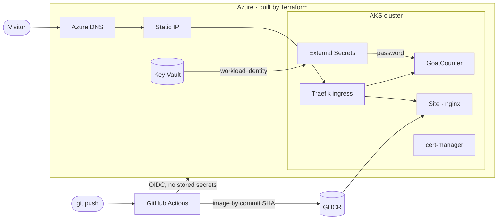

# john.arias.sh

Source for my personal site, **[john.arias.sh](https://john.arias.sh)**, and every piece of infrastructure behind it.
A merged pull request is the only way anything changes.

## How it fits together

| Layer | Tool | Lives in |
| --- | --- | --- |
| Cloud resources: network, AKS, DNS, Key Vault, identities | Terraform | [`terraform/`](terraform) |
| Cluster add-ons: Traefik, cert-manager, External Secrets | Terraform Helm provider | [`terraform/addons.tf`](terraform/addons.tf) |
| Workloads, routes, certificates, secret references | Plain Kubernetes YAML | [`k8s/`](k8s) |
| Website | Static HTML in an unprivileged nginx image | [`site/`](site) |
| Pipelines | GitHub Actions | [`.github/workflows/`](.github/workflows) |

## How a commit becomes a deployment

Every change goes through a pull request. Workflows are path-filtered, so only what changed is rebuilt.

| Change in | On the pull request | On merge to `main` |
| --- | --- | --- |
| `terraform/` | `fmt`, `validate`, `plan` posted as a PR comment | `apply` of that exact plan |
| `k8s/` | Server-side dry run against the live cluster | `kubectl apply` |
| `site/` | Image build | Push to GHCR tagged with the commit SHA, rolling update with zero downtime |

A scheduled workflow rotates the analytics admin password monthly, and Dependabot proposes dependency updates weekly.

## Security choices

- **No secrets in GitHub, not even encrypted.** Pipelines sign in to Azure with OIDC federation, trusted only for this repo's `main` branch and pull requests.
- **Secret values live only in Azure Key Vault.** External Secrets Operator reads them via AKS workload identity, so the cluster holds no cloud credential either.
- **No static cluster credentials.** AKS local accounts are disabled; access is Entra ID with Azure RBAC.
- **Terraform state** sits in a private storage account with shared-key access disabled, versioning, soft delete and a delete lock.
- **TLS everywhere.** Let's Encrypt certificates are issued and renewed by cert-manager; HTTP redirects to HTTPS and HSTS is on.
- **Hardened containers.** Non-root, dropped Linux capabilities, read-only root filesystem for the site, resource limits on every pod.
- **Least privilege.** The pipeline identity is scoped to one resource group, plus blob access to the state container.

## Analytics

Privacy-friendly, cookie-free page counts by self-hosted [GoatCounter](https://www.goatcounter.com/), with its database on an Azure managed disk.

## Running cost

Roughly $50–60/month, almost all of it the single AKS node and its load balancer. The AKS control plane is on the Free tier.